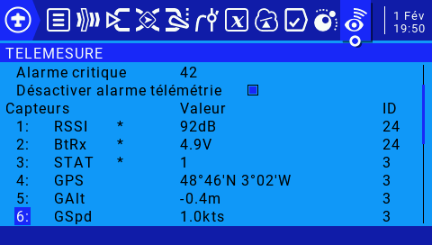

Cette version s'appui sur la librairie de PawelSky https://www.rcgroups.com/forums/showatt.php?attachmentid=14504485&d=1610286712 à copier sous libraries/ 

La base est la même que le projet https://github.com/dev-fred/GPS_Tracker_ESP8266/tree/main/GPS_Tracker_ESP8266V1_WEB pour la compilation et la partie smartphone.

Sur la Radio après la découvertes des capteurs

Il suffira de renommer 0860 en HDOP et de mettre une Précision de 0.00 et de renommer 0870 en SAT

Et de renommer 0880

"

En STAT

En ajoutant le Widget Balise contenu dans le fichier WIDGETS.zip on pourra afficher facilement les coordonnées GPS, le HDOP, le nombre de SAT et le STATUS

on le trouve ici https://github.com/dev-fred/GPS_Tracker_ESP8266/blob/main/GPS_Tracker_ESP8266V1_WEB_FRSKY/WIDGETS.zip

## Note
Cette version ne peut pas utiliser la fonction delay() dans la boucle principal car celà désamorce le flot de données du Sport; le code du buzzer n'est pas implémenté car il utilise cette fonction.

## Câblage

