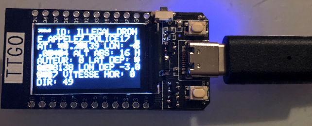
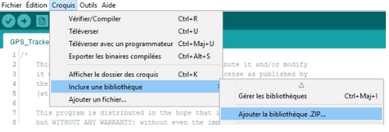
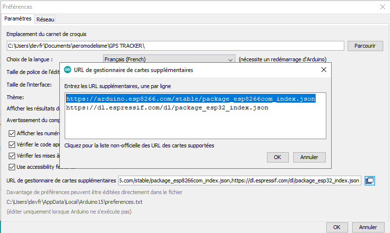
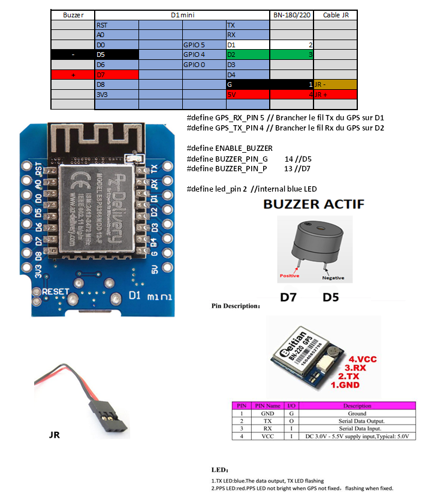
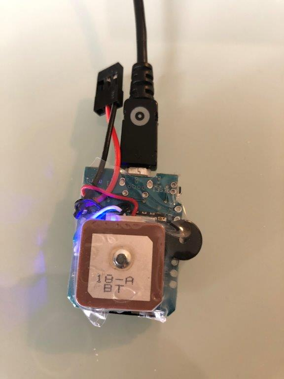
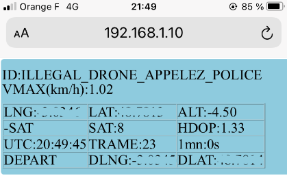
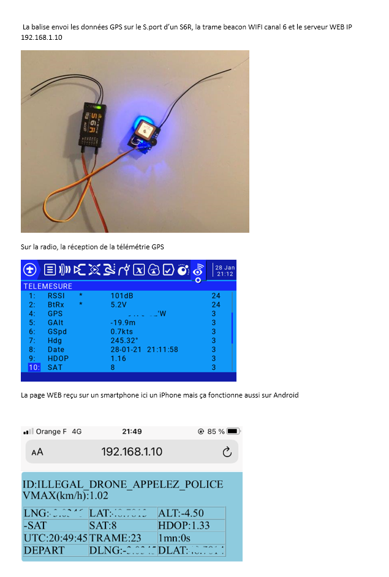
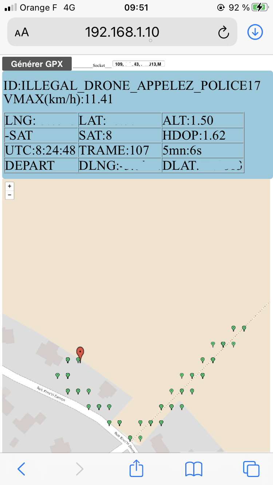

#### Préambule

Durant la mise au point des balises, voici un décodeur/afficheur de trames beacons bien pratique basé sur une carte TTGO T-Display ESP32 décrite ici http://www.lilygo.cn/prod_view.aspx?TypeId=50033&Id=1126&FId=t3:50033:3

https://github.com/dev-fred/Decode_balise_ESP32/tree/master/Decode_Balise_ESP32_TFT

# GPS_Tracker_ESP8266V1  

### [Code](GPS_Tracker_ESP8266V1)

Balise basé sur https://github.com/f5soh/balise_esp32 et adapté pour un ESP8266 D1 mini.

Fonctionne avec un buzzer actif optionnel et un GPS BN-180 ou un BN-220, pèse 11g.

### Librairie TinyGPS++

Télécharger la librairie zip https://github.com/mikalhart/TinyGPSPlus/releases

 

### Carte 
Se compile avec le type de carte "Generic ESP8266 Module"

Que l'on obtient après avoir ajouté l'URL https://arduino.esp8266.com/stable/package_esp8266com_index.json dans Fichier->Préférences->URL de gestionnaire de cartes supplémentaires et installé "esp8266" dans Outils->Gestionnaire de carte

 

### Câblage

### Face avant 

#### Code du buzzer optionnel

* tick = phase de recherche de satellites
* Beep = un satellite de +
* Beep Beep Beep = enregistrement des coordonnées de départ

#### Code de la led bleue esp8266

*  reste allumée durant la phase de recherche de satellites qui s'achève avec l'enregistrement de la position de départ quand hdop < 2.0 et nb sats > 5
*  change d'état à chaque envoi de trame toutes les 3 secondes

#### Code des leds du GPS

* TX LED BLEUE  : Clignote à chaque donnée transmise
* PPS LED ROUGE : Eteinte lorque le GPS ne reçoit pas de satellite, 1 Pulse Par Seconde si 3D fix => >= 4 satellites

# GPS_Tracker_ESP8266V1_WEB

### [Code](GPS_Tracker_ESP8266V1_WEB)

Ajoute un serveur WEB dans la balise qui permet de recevoir en même temps que la trame est émise, les données GPS sur son smartphone via un navigateur. Il faudra au préalabre se connecter sur l'adresse IP de ce serveur.

# GPS_Tracker_ESP8266V1_WEB_FRSKY

### [Code](GPS_Tracker_ESP8266V1_WEB_FRSKY)

Battit au dessus de GPS_Tracker_ESP8266V1_WEB, cette version ajoute une sortie FRSKY S.port sur le connecteur JR d'alimentation afin d'envoyer les données du GPS de la balise à un récepteur FRSKY.

# GPS_Tracker_ESP8266V1_MAP

### [Code](GPS_Tracker_ESP8266V1_MAP)

Battit au dessus de GPS_Tracker_ESP8266V1_WEB, cette version permet l'affichage d'une carte utilisant Open Street Map, un projet ayant le but de créer une carte libre du monde et Leaflet, une bibliothèque Javascript open-source.
Elle est plus délicate à faire fonctionner sur un smartphone que la version GPS_Tracker_ESP8266V1_WEB.
En effet il faut que le téléphone mobile soit capable de gérer une double connection : sur l'internet via la 4G pour charger la carte ET sur la balise pour recueillir les données GPS. 
Elle tourne sur un esp8266 WEMOS D1 mini relié à un GPS BN220 -> carte Wemos D1 R1 et Flash size "4M (FS:none OTA:~1019KB)".

Le bouton **Générer GPX** produit un fichier GPX des couples (Lon, Lat) accumulés.

